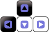

  

<h1 align="center">JUNGLE GAME</h1>

  <strong>Made by Jenny Cárdenas</strong>
   
   This is a platform game developed using phaser. The player play the role of Gamora, she collect coins, avoid orcs and find a tresure chest to win. The game is developed specifically for the web.

  
   ‎ ‎ ‎ ‎
  

## 👩🏼‍💻 About Jungle game

## 🔴 Live Demo:

[Play the game](https://janis-jenny.github.io/Jungle-Game/)

## 🔧 Built With

- Phaser
- HTML5
- CSS3
- JS (ES6)
- Webpack
- Babel
- VS Code

## 🎨 Game Design Document

The game design document can be found [here](./GameDesignDocument.md)

## 🤖 How it works

To get a local copy up and running follow these simple steps:

1. Go to the [repository page](https://github.com/janis-jenny/Jungle-Game).
2. Press the "Code" button and copy the link.
3. Clone it using git command `git clone <you_repository_link>`.
4. Move to the local project: cd `<Your_repository_name>`.
5. Install webpack locally, go to the repo's root an run `npm install --save-dev webpack`
6. Run `npm install` to get all the dependencies.
7. Run `npm start` to build the project and start the server
8. To run tests, run `npm run test`

## 🎮 How to play

## Characters

The game has 2 main characters:

1. The player, called Gamora, designed to move all over directions.
2. The orcs are moving back and forth in the ground platforms.

The main goal of Gamora is to find the treasure chest to end her adventure and collect as many coins as possible to score higher while avoiding orcs and not falling down from the platforms.

### Game Control

To play the game, the arrow keys highlighted below will be very crucial.

- Once the game loads, Fill in your name and then click the "Play" Button
- Please note that a name should be more than 2 characters
- Use arrow keys to control Gamora and escape from orcs and to not fall down.
- Use the up arrow key to do jumps and double jumps
- Collect the coins. The more coins you collect, the higher the score.

## 👥 Author

👤 **Jenny Cárdenas**

- GitHub: [@janis_jenny](https://github.com/janis-jenny)
- Twitter: [@janis_jenny](https://twitter.com/janis_jenny)
- LinkedIn: [Jenny Càrdenas](https://www.linkedin.com/in/paolajenny)

## 🤝 Contributing

Contributions, issues, and feature requests are welcome!

Feel free to check the [issues page](https://github.com/janis-jenny/Jungle-Game/issues).

## ⭐ Show your support

Give a ⭐️ if you like this project!

## 📌 Acknowledgments

- [Open Game Art](https://opengameart.org/) for the free sprites.
- [Craftpix.net](https://craftpix.net/) for the free sprites.
- [Microverse](https://www.microverse.org/)
- [Srackoverflow](https://stackoverflow.com/)
- Stand up team
- Special thanks to [Codecademy](https://codecademy.com/) for making available free phaser tutorials 

## 📝 License

This project is [MIT](https://opensource.org/licenses/MIT) licensed.