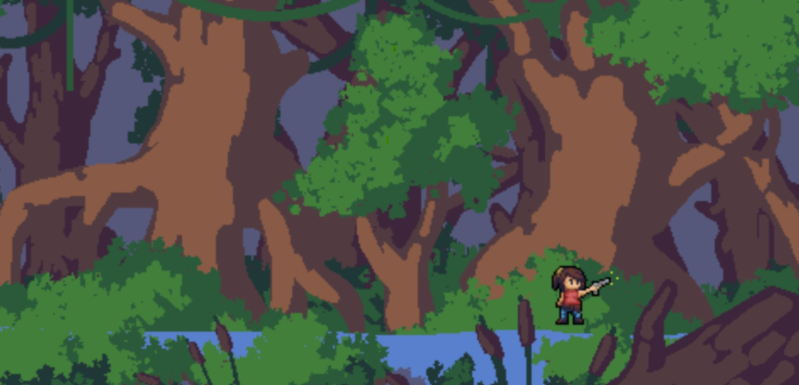
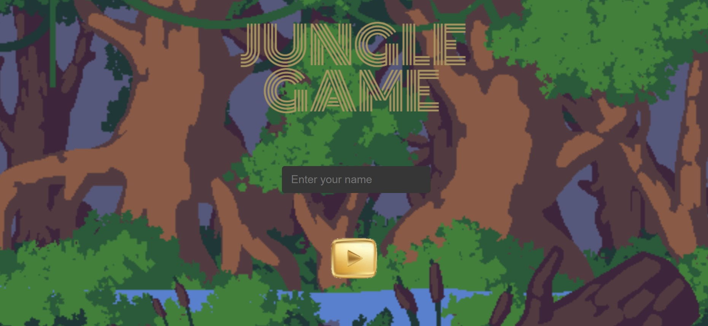
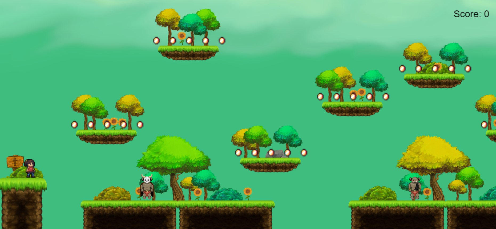
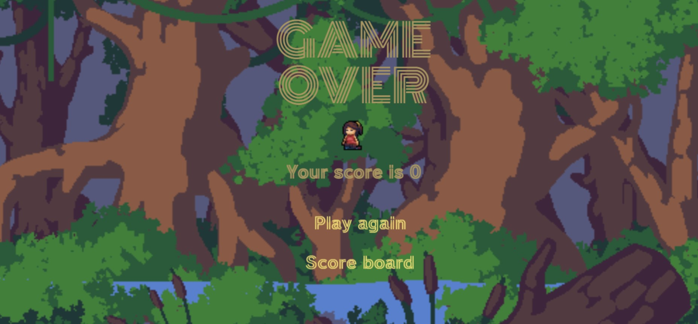
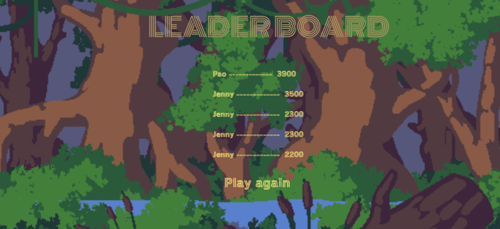
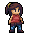
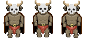
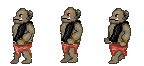
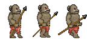

# The Jungle

**Writer: Jenny C**

# Table of contents

- [Story Overview](#Story-Overview)
- [Game Controls](#Game-Controls)
- [Third party applications](#Third-party-applications)
- [Scenes](#Scenes)
- [HUD system](#HUD-system)
- [Player characters](#Player-characters)
  - [Player](#Player)
  - [Enemies](#Enemies)
- [Player skills](#Player-skills)
- [Health](#Health)
- [Scoring](#Scoring)

## Story Overview

Gamor go to an adventure in the jungle to find a treasure chest. In the uphill journey to find the tresure, Gamora will face some obstacles and orcs that she have to avoid or kill. She will gain points through the way to the tresure chest, when she collect the coins. 

## Game Controls

- Use left and right arrow keys to move Gamora,
- Up arrow key to jump
  
### Third party applications

- Phaser framework
- JavaScript ES6 Modules
- HTML5
- CSS3
- Webpack
- Babel

## Scenes

- **Boot scene** It displays Gamora walking and shooting in the background jungle. background.

- **Intro scene** It displays a form to fill in your name, a play button, and the jungle image as a background

- **Main Scene**.- The player's helicopter shows up in the middle and then enemy jets start entering the air space with their bombs.

- **Game Over**.- When the player's helicopter is hit, the game over scene will show up. It displays your score, as well as options to play again or view the leaderboard.

- **Leader board**.- Display only the top 5 gamers. From here, you have an option to play again.

## HUD system 
There's no any health status in this level, but we could see a score displaying each time player collect coins.

## Player characters
  ### Player
    
 

  This is the player, called Gamora, designed to move all over directions

  ### Enemies

  **Enemy 1**

 

  It will be move back and forth in the ground platforms.

  **Enemy 2**

 

  It will be move back and forth in the ground platforms.

  **Enemy 3**

 

  It will be move back and forth in the ground platforms.

  
## Player skills

**Player**.- Moves in any directions around the game scene, she can do a double jump to go through the platforms and avoid the orcs.

## Health 

**Player**.- Dies when she falls down from the platforms and when she touches the orcs.

## Scoring

  The player scores 100 points once they find and collect a coin.